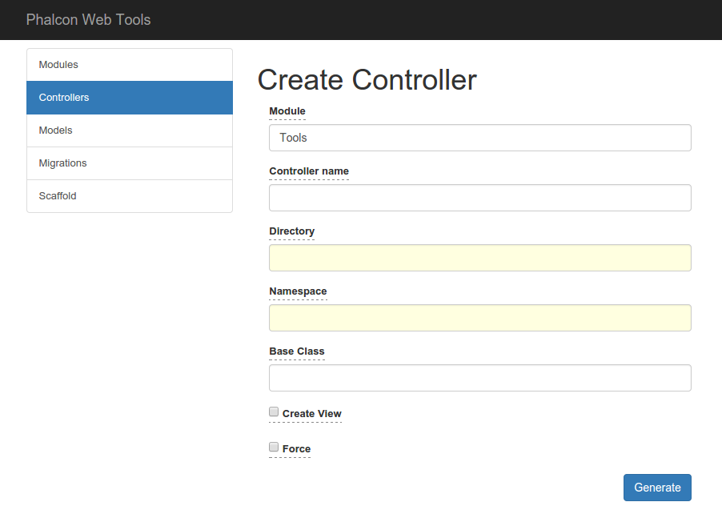

Phalcon Web Tools
=================
This is a more flexible alternative to Phalcon Web Tools provided as a stand alone application.

It can be used as a module as long you set up everything.


[](LICENSE.txt?raw=true)

## Installation

### Via Composer Create-Project

Run this in your terminal to get the latest Composer version:

```bash
curl -sS https://getcomposer.org/installer | php
```

Or if you don't have curl:

```bash
php -r "readfile('https://getcomposer.org/installer');" | php
```

This installer script will simply check some php.ini settings, warn you if they are set incorrectly, and then download the latest composer.phar in the current directory

Then run

```bash
php composer.phar create-project magnxpyr/phalcon-webtools -s dev
```

If you have already installed composer

```bash
composer create-project magnxpyr/phalcon-webtools -s dev
```

### Via Composer json file

Create a composer.json file as follows:
```json
{  
    "require": {  
        "magnxpyr/phalcon-webtools": "dev-master"  
    }  
}
```

Run the composer installer:

```bash
php composer.phar install
```

or

```bash
composer install
```

### Installing via GitHub

Just clone the repository:

```
git clone git@github.com:magnxpyr/phalcon-webtools.git
```

### Set up environment settings
Set up your environment settings in 'app/config/config.php':

- set your database details on 'database'
- set your base url on 'application > baseUri'
- set tools config
```php
'tools' => array(
        'copyright' => "", // copyright header for generated files; default empty
        'modulesPath' => '', // path to your modules/app directory; mandatory
        'migrationsPath' => '', // path to migrations directory; mandatory
        'viewsDir' => '', // default Views
        'modulesDir' => '', // default Modules
        'controllersDir' => '', // default Controllers
        'formsDir' => '', // default Forms
        'allow' => '', // IP, default only 127.0.0.1
        'baseController' => [], // default Phalcon\Mvc\Controller
        'baseModel' => [], // default Phalcon\Mvc\Model
        'baseForm' => [], // default Phalcon\Mvc\Model
        'baseModule' => '', // default empty
        'baseRoute' => '' // default empty
    )
```
Define only what you need and remove/comment the rest.

If you're fine with the default configuration, define only 'modulesPath' and 'migrationsPath'

Requirements
------------
To run this application, you need at least:
- >= PHP 5.4
- Phalcon 2.0.x
- Apache Web Server with mod rewrite enabled

Third Party
-----------
* jQuery 1.11.3: https://jquery.org/ (MIT)
* jQuery UI 1.11.4 https://jqueryui.com/ (MIT)
* Bootstrap 3 http://getbootstrap.com/ (MIT)

Screenshot
----------
[](screenshot.png?raw=true "Controller Page")
